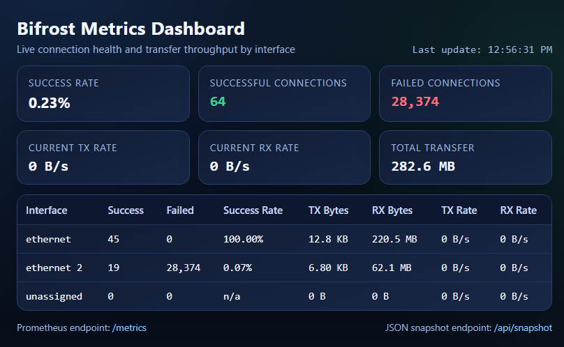

# Bifrost

<p align="center">
  
</p>

A weighted multi-interface TCP reverse proxy for bypassing system routing and using multiple iFaces concurrently.

Bifrost allows you to distribute outbound TCP connections across multiple network interfaces with configurable weights. This enables bandwidth aggregation and higher concurrency by utilizing all available network paths simultaneously.

## Features

* Multi-interface outbound routing
* Weighted load distribution
* Bypasses system routing decisions
* Works with any TCP-based protocol
* Simple YAML configuration
* Designed for high concurrency

## Use Cases

* Combine LAN + WiFi + Multiple USB tethering
* Maximize download throughput from a single server
* Maximize internet throughput using a socks proxy
* Increase parallel connection limits
* Control traffic distribution per interface
* Work around restrictive routing policies

## How It Works

Each incoming connection is proxied to the upstream server using one selected network interface.

Interface selection is based on configured weights and current active load:

* Higher weight allows proportionally more concurrent active connections
* New connections are assigned to the interface with the lowest active/weight ratio
* Ties are broken in round-robin order

Example:

* eth0 weight 2
* eth1 weight 5

Result:

* eth0 is allowed about 2/7 of active concurrent connections
* eth1 is allowed about 5/7 of active concurrent connections

This applies per connection, not per packet.

## Configuration

Example configuration:

```yaml
listen: 127.0.0.1:8080
server: 94.93.92.91:8080
metrics: 0.0.0.0:3000

cache:
  ttl: 30s
  prefetch: false

ifaces:
  eth0:
    weight: 2
    # optional: force source IP instead of resolving from interface
    # source_ip: 192.168.1.10
  eth1:
    weight: 5
    # source_ip: 10.0.0.22
```

### Fields

* listen: local address to accept incoming connections
* server: upstream target address
* metrics: optional metrics/dashboard listener; when set, exposes `/metrics`, `/api/snapshot`, and `/`
* cache.ttl: TTL for interface IP lookup cache (for example: `30s`, `5m`, `0s`)
* cache.prefetch: when `true`, resolve interface IPs at startup and keep them permanently (no per-connection lookup)
* ifaces: map of network interfaces

Each interface:

* weight: relative selection weight
* source_ip (optional): static bind IP for that interface; if set, Bifrost uses it directly

## Behavior

* Each new connection is assigned an interface
* Interface selection is weighted by active load and per-connection
* Traffic flows entirely through that interface
* If `source_ip` is set for the selected interface, that IP is used for outbound bind
* Otherwise, bind IP is resolved from the interface and cached according to `cache.ttl`
* With `cache.prefetch: true`, bind IPs are prefetched once at startup and reused
* No packet-level balancing
* No kernel bonding required

## Metrics and Dashboard

When `metrics` is set, Bifrost starts a small web server:

* `/metrics`: Prometheus scrape endpoint
* `/api/snapshot`: JSON summary for live counters/rates
* `/`: built-in dashboard (single HTML page with inline CSS/JS)

Exported Prometheus metrics:

* `bifrost_failed_connections_total{iface}`
* `bifrost_successful_connections_total{iface}`
* `bifrost_transfer_bytes_total{iface,direction}` where `direction` is `tx` or `rx`
* `bifrost_connection_tx_bytes{iface}` histogram (per successful connection)
* `bifrost_connection_rx_bytes{iface}` histogram (per successful connection)

## Example

1. Start a socks5 server on your own server without a limited bandwidth,

2. Run Bifrost:

```bash
bifrost --config config.yaml
```

Then connect clients to `127.0.0.1:8080`
Traffic will be distributed across eth0 and eth1 according to weights.

## Limitations

* Single connection cannot exceed bandwidth of one interface
* Requires multiple connections for aggregation
* Depends on upstream allowing parallel connections
* No built-in health checks unless implemented

## Future Improvements

* Interface health monitoring
* Dynamic weight adjustment (reputation)
* Failover handling
* Max traffic per interface
* Max connections per interface
* Connection pool
